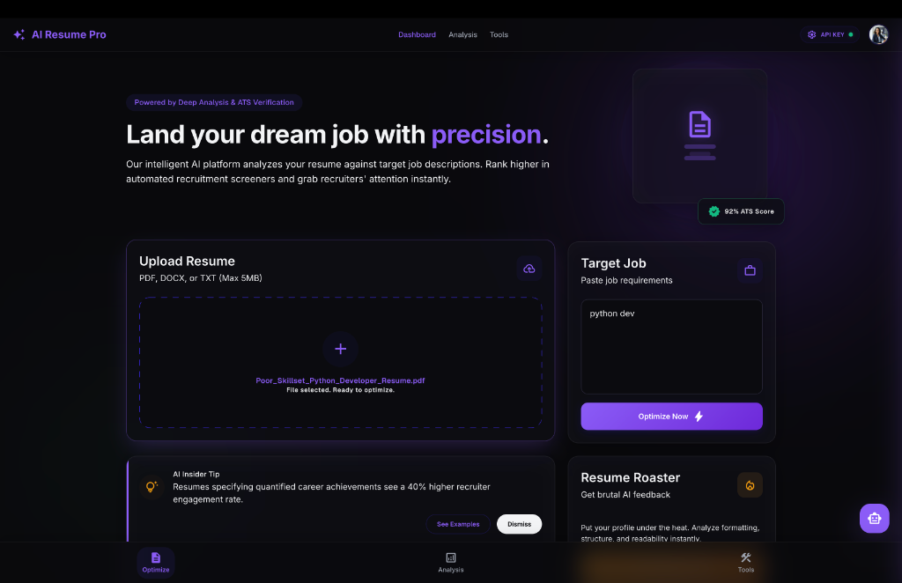
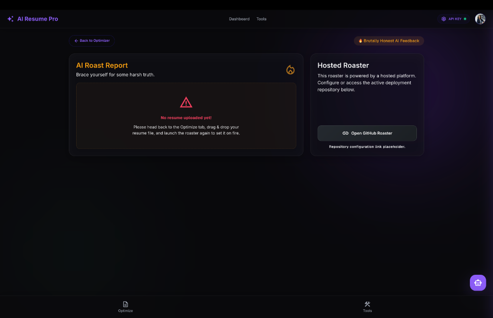
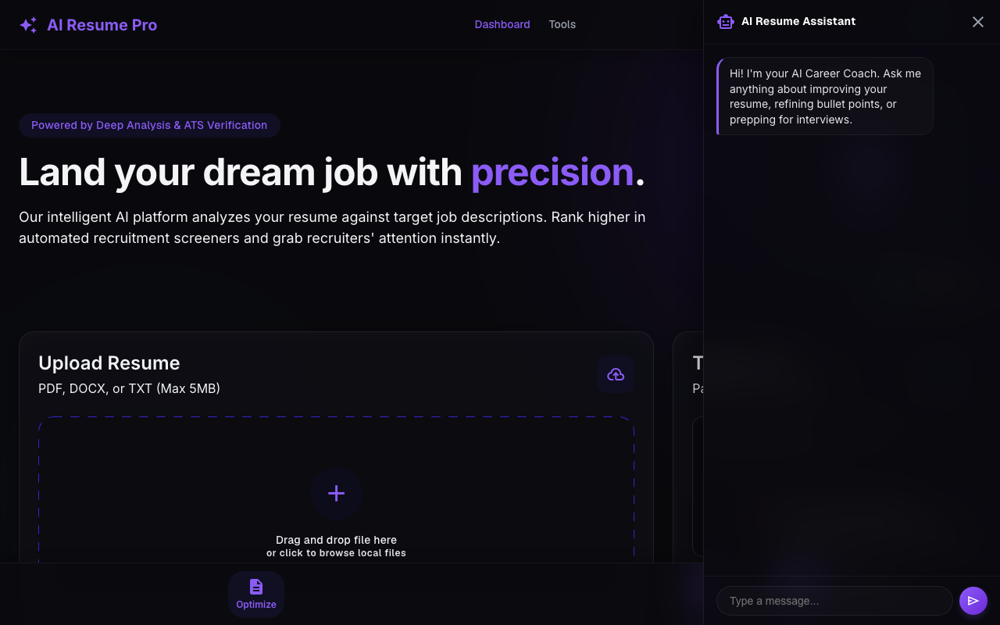
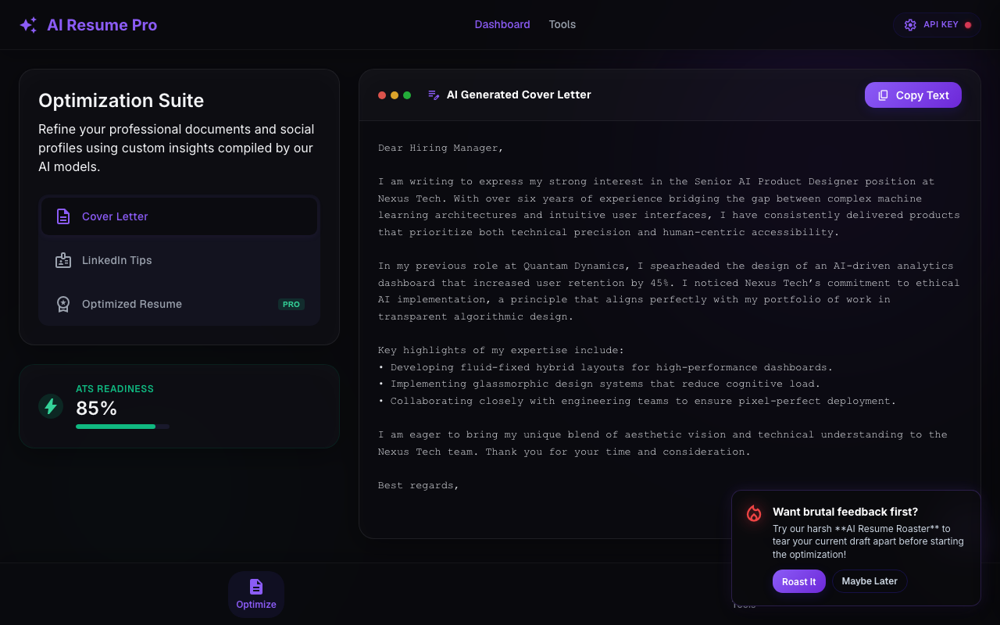

# 🌟 AI Resume Pro — Optimize Your Career

A premium, state-of-the-art Single Page Web Application (SPA) designed to parse, analyze, and optimize resumes against target job descriptions using client-side AI integration. Built using HTML, CSS, JavaScript, and Vite.

🔗 **[Launch Live Web Application](https://phani06041.github.io/AI_Resume_optimiser/)**

---

## 🎨 Preview & Interface Showcases

<p align="center">
  
  
</p>

<p align="center">
  
  
</p>
<p align="center">
  ☝️ <i>Tip: Access the custom AI Career Coach drawer by tapping the <b>floating 🤖 chatbot button at the bottom-right</b> on any screen!</i>
</p>

---

## ⚡ Core Features

* **Real-time Document Parser**: Client-side extraction of `.pdf`, `.docx`, and `.txt` files immediately on select to make all transitions instant.
* **Circular SVG Match Meter**: Visually synced score indicators across dashboard badges, analysis metrics, and sidebar progress trackers.
* **Self-Healing LLM Executor**: Automatic rate-limit detection fallback between Google Gemini and OpenAI models.
* **Zero-Delay Bidirectional Roaster**: Pre-loads the Resume Roaster Vercel app in the background. Pushes local resume data to the Vercel app via `postMessage` on transition, and syncs external roaster uploads back to your parent optimizer automatically!
* **Resume Exporter**: Download cover letters and refined resumes as Plain Text, Markdown, HTML, or styled print-ready PDF files.

---

## 🚀 Setup & Local Installation

### Prerequisites
* **Node.js** (v18 or higher recommended)
* **npm** (comes bundled with Node)

### 1. Clone the repository
```bash
git clone https://github.com/phani06041/AI_Resume_optimiser.git
cd AI_Resume_optimiser
```

### 2. Install dependencies
```bash
npm install
```

### 3. Run the development server
```bash
npm run dev
```
Access the local preview at: **`http://localhost:5173/`**

### 4. Compile the production bundle
```bash
npm run build
```

---

## 🛸 GitHub Pages Auto-Deployment

The repository is pre-configured with a **GitHub Actions CI/CD Pipeline** that automates deployment on push.

### Workflow Configuration:
* File location: `.github/workflows/deploy.yml`
* Target Branch: `gh-pages`
* Project Base URL configured inside: `vite.config.js`

### To deploy your updates:
1. Ensure your settings branch is linked: Go to **Settings** -> **Pages** inside your GitHub repository.
2. Under **Build and deployment**, set the branch source option to **`gh-pages`** and click **Save**.
3. Push your commits to `main` and the pipeline will build and serve your site automatically!
